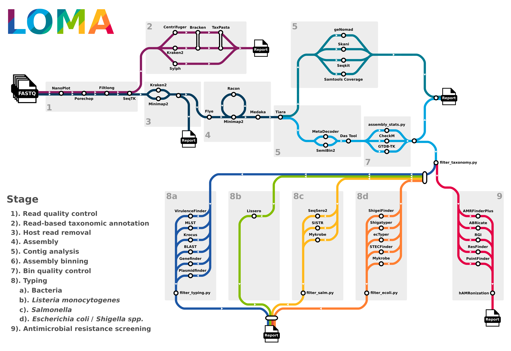
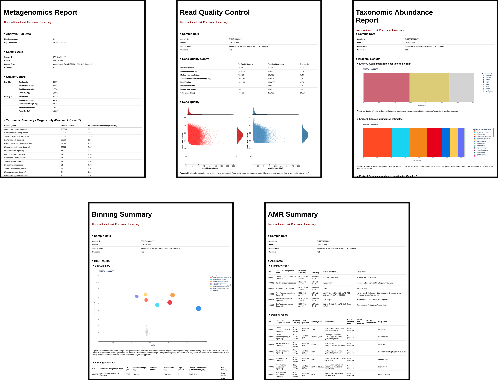

<p align="left">
    
</p>

***

[](https://www.nextflow.io/)
[](https://sylabs.io/docs/)
[](https://apptainer.org/docs/user/main/index.html#)

# Pre-release notes

**Please note, this code is actively being updated.**

Updates:
- Genefinder and BLAST functionality has temporarily been removed while the input data file format is changed.
- Docker will be supported but has not been fully tested on our systems.

# Table of contents 
* [Introduction](#Introduction)
* [Summary](#summary)
* [Installation](#install)
* [Running](#run)
* [Output](#output)
* [Improving speed and efficiency](#tips)
* [Troubleshooting and errors](#troubleshoot)

# Introduction <a name="Introduction"></a>

LOMA is a Nextflow pipeline designed to comprehensively assess metagenomic samples sequenced using the Oxford Nanopore (long-read) platform.

The pipeline has two primary approaches to analysis:\
&nbsp;&nbsp;&nbsp;&nbsp;&nbsp;**1). Read-based taxonomic classification** - assign a taxonomic designation to individual sequencing reads.\
&nbsp;&nbsp;&nbsp;&nbsp;&nbsp;**2). Metagenome assembly** - assemble and perform *in silico* typing typing of metagenome assembled genomes.

A general overview is provided below. Detailed guidance on the installation, usage and function of LOMA can be found in the **[wiki](https://github.com/ukhsa-collaboration/LOMA/wiki)**, example outputs can be found **[here](https://github.com/ukhsa-collaboration/LOMA/blob/main/examples/results/)**.

# Pipeline summary <a name="summary"></a>

## Simplified schematic overview 
<p align="center">
    
</p>

## Description

The pipeline will perform the following steps: 

**1). Read quality control** - Assess read quality, remove adapters and filter long-reads by quality.\
**2). Read-based taxonomic annotation** - Read-based taxonomic classification and standardization.\
**3). Host read removal** - Identify and remove host-contaminant reads.\
**4). Assembly** - Assembly of reads into metagenome and polishing (contig error correction).\
**5). Contig analysis** - Per-contig identification of taxonomic hits, mobile genetic elements and contig statistics.\
**6). Assembly binning** - Classify and bin contigs into individual metagenome assembled genomes (MAGs).\
**7). Bin quality control** - Assess the quality of MAGs and merge bin QC and contig QC results into summary reports.\
**8). Typing** - Subset MAGs (target species) and pass them on to individual subworkflows (run per-MAG).\
&nbsp;&nbsp;&nbsp;&nbsp;**8a). Bacteria** - Identification of genes of interest, multi-locus sequence type and screen for plasmids.\
&nbsp;&nbsp;&nbsp;&nbsp;**8b). *Listeria monocytogenes*** - Perform *in silico* serogroup prediction of *L. monocytogenes*.\
&nbsp;&nbsp;&nbsp;&nbsp;**8c). *Salmonella*** - Perform *in silico* *Salmonella* serotyping, identify cgMLST alleles and lineages.\
&nbsp;&nbsp;&nbsp;&nbsp;**8d). *Escherichia coli*/*Shigella spp.*** - Identify pathotype, serotype and lineage of *E. coli*/*Shigella spp.*\
**9). Antimicrobial resistance** - Identify AMR genes (incl. point mutations), virulence/stress resistance genes.

# Installation <a name="install"></a>

Step by step instructions for installation and initital runs can be found on the **[wiki](https://github.com/ukhsa-collaboration/LOMA/wiki/1\).-Installation)**. A short summary is also given below. 

### Software 
- [Nextflow](https://www.nextflow.io/docs/latest/install.html).
- [Java 11 (or later, up to 22)](http://www.oracle.com/technetwork/java/javase/downloads/index.html) (required for Nextflow).
- A container runtime, currently [Singularity](https://sylabs.io/singularity/) and [Apptainer](https://apptainer.org/docs/admin/main/index.html) are supported.
- [Git](https://github.com/git-guides/install-git).
### Hardware
- A POSIX-compatible system (Linux, macOS, etc) or Windows through [WSL](https://en.wikipedia.org/wiki/Windows_Subsystem_for_Linux).
- At least 16GB of RAM.
- At least 100 GB of storage.
  > ℹ️ Storage requirements
  > - The pipeline installation requires 100 Mb of storage.
  > - Combined the default databases use 120 GB of storage.
  > - Containers require a total of 11 GB of storage.
  > - The pipeline generates a variable number/size of input files, depending on input size and quality. Generally this ranges from 30-60 Gb. 
  > - The pipeline output generates ~200 Mb of output files per-sample.

### Databases
- Mandatory: A host reference database (genome assembly and/or Kraken2 database).
- Optional: Up to 14 databases containing relevant reference datasets. 
  > ℹ️ Optional databases
  > - If optional databases are not installed the pipeline will still run without error but the associated stages will be skipped. 
  > - A **[script](https://github.com/ukhsa-collaboration/LOMA/blob/main/bin/get_dbs.py)** is provided which will download any requested databases and update the relevant config files.

  > - It is highly recommended to install the at least one of: Kraken2, Centrifuger and/or Slyph databases, as this is required for read-based taxonomic assignment. 
  > - It is highly recommended to install the Genome Taxonomy Database (GTDB) as this is required to add taxonomic assignments to metagenome-assembled genomes.
  > - It is highly recommended to install geNomad and Skani databases as these are required for contig classification. 

Detailed installation instructions for LOMA and associated databases can be found on the **[wiki](https://github.com/ukhsa-collaboration/LOMA/wiki/1\).-Installation#databases-)**.

# Running  <a name="run"></a>

## Usage

There is only one mandatory parameter for running LOMA, an input file (format detailed below).

```
./run_loma --input input.tsv
```

## Input file structure

The input file (e.g. 'input.tsv') is a five column tab-separated file with the following structure:
```
RUN_ID  BARCODE_ID  SAMPLE_ID   SAMPLE_TYPE /FULL/PATH/TO/FASTQ_FILE
```
- _RUN_ID_:                       Run identifier, will determine the highest level directory name in the results directory
- _BARCODE_ID_:                   Sample barcode 
- _SAMPLE_ID_:                    Sample identifier, will determine the subdirectory where results are stored per-sample
- _SAMPLE_TYPE_:                  Sample description, will be added to the reports, but doesn't change how the sample is processed. 
- _/FULL/PATH/TO/FASTQ_FILE_:     Location of input FASTQ files.

  > ℹ️ Input file formatting
  > - Any number of samples can be included provided they do not have both identical RUN_ID and SAMPLE_ID's.
  > - Inputs containing spaces should be enclosed in quotation marks (").
  > - Periods ('.') will automatically bereplaced with underscores ('_') in the output.


### Example input file:
```
RUN01	RB01	SAMPLE_1	BLOOD	/data/reads/SAMPLE_1.BLOOD.fq.gz
RUN01	RB02	SAMPLE_2	BLOOD	/data/reads/SAMPLE_2.BLOOD.fq.gz
RUN02	UNKNOWN	SAMPLE_3	SALIVA	/data/reads/SAMPLE_3.NASOPHARYNGEAL.fq.gz
RUN03	XBD     SAMPLE_1	SKIN	/data/reads/SAMPLE_3.SKIN.fq.gz
```

## Optional parameters

A full list of optional parameters for LOMA can be found on the **[wiki](https://github.com/ukhsa-collaboration/LOMA/wiki/3\).-Running)**.

Major optional parameters can be shown with:
```
./run_loma -h
```
The full list of parameters can be shown with:
```
./run_loma --validationShowHiddenParams
```

# Output  <a name="output"></a>

## Output folder structure

LOMA outputs can be grouped into two major categories:
- Per-metric outputs, created for each analysis step.
  - A graphical summary of the output folder structure can be found on the **[wiki](https://github.com/ukhsa-collaboration/LOMA/wiki/4\).-Output)**.
- Summary outputs - HTML and TSV reports (see below).

### HTML reports
- HTML reports can be found in the output 'summary' directory, covering major analysis areas, along with an overall summary report.
    - **<SAMPLE_ID>.<RUN_ID>.summary_report.html** - Simiplified summary detailing all major metrics.
    - **<SAMPLE_ID>.<RUN_ID>.readqc_report.html** - Read quality metrics, pre- and post- quality control.
    - **<SAMPLE_ID>.<RUN_ID>.taxonomy_report.html** - Read-based taxonomic abundances.
    - **<SAMPLE_ID>.<RUN_ID>.amr_report.html** - Results of AMR typing tools.
    - **<SAMPLE_ID>.<RUN_ID>.summary_binning_report.html** - Summary of binning results.
      
- Example reports using data for the ZymoBIOMICS HMW DNA Standard (ERR7287988), can be found **[here](https://github.com/ukhsa-collaboration/LOMA/blob/main/examples/results/)**.
<br>
<p align="center">
    
</p>

# Improving speed and efficiency  <a name="tips"></a>

### Skipping major analysis steps

When specified, the following parameters will skip substantial sections of the pipeline, saving resources if the results are not of interest:
```
  --skip_assembly                                 Skip read assembly.
  --skip_taxonomic_profiling                      Skip read-based taxonomic profiling.
  --skip_prokarya_typing                          Skip metagenome assembled genome analyses.
```
### Skipping read-based taxonomic annotation
Excluding taxonomic databases will skip the associated step, reducing overall runtime. 
```
  --TAXONOMIC_PROFILING.krakendb=""               Skip Kraken2 taxonomic profiling
  --TAXONOMIC_PROFILING.centrifugerdb=""          Skip Centrifuger taxonomic profiling
  --TAXONOMIC_PROFILING.sylphdb=""                Skip Sylph taxonomic profiling
```
### Skipping/reducing polishing

Assembly error correction is a very time consuming step. To save time you can reduce the number of rounds of Racon polishing:
```
  --ASSEMBLY.racon_rounds 1                       Runs 1 round of Racon polishing (default:4, range: 0-4)
```
If you find the per-base accuracy of your MAGs are low, even after polishing with Racon. You can enable Medaka polishing (very slow, so disabled by default):
```
  --ASSEMBLY.medaka                               Perform metagenome assembly polishing with Medaka.
```
However, a quicker approach is to only polish the MAGs of interest. This can be done by specifying: 
```
  --BIN_TAXONOMY.medaka_mag                       Polish individual metagenome assembled genomes with Medaka.
```
Further tips for optimization can be found on the **[wiki](https://github.com/ukhsa-collaboration/LOMA/wiki/3\).-Running#reducing-runtime-)**.

# Troubleshooting and errors  <a name="troubleshoot"></a>

Advice on how to identify, diagnose and fix errors can be found on the **[wiki](https://github.com/ukhsa-collaboration/LOMA/wiki/5\).-Troubleshooting#errors)**.


